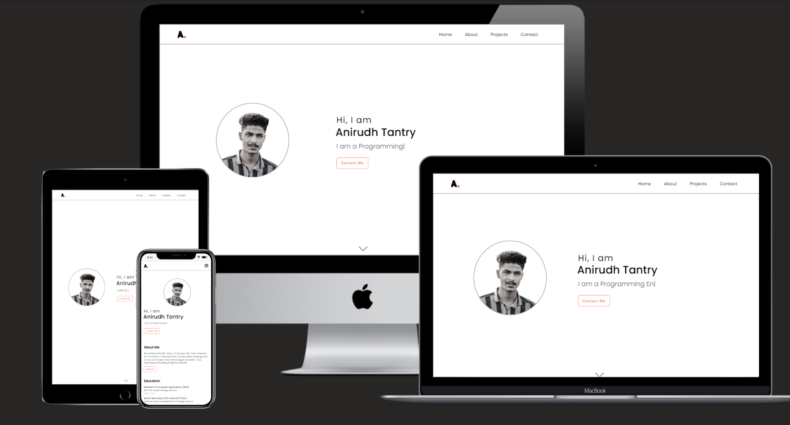

<h1>Personal Portfolio Website - v0.1.0</h1>

<h2>
  <a href="https://anirudhtantry.me">anirudhtantry.me</a>
</h2>

  

 

⭐ Star this repo on GitHub — it helps!

## Features 📋

⚡️ Fully Responsive\
⚡️ Valid HTML5 & CSS3\
⚡️ Typing animation\
⚡️ Functional Contact Form

## Sections 📚

✔️ Home\
✔️ About\
✔️ Skills \
✔️ Qualifications \
✔️ Projects\
✔️ Contact Me\
✔️ Footer

To view a live example, **[click here](https://anirudhtantry.me)**

## Tools Used 🛠️

- [**Netlify**](https://docs.netlify.com/get-started/) - To host my static website (HTML, CSS, JS).
- [**Font Awesome**](https://fontawesome.com/) - A font and icon toolkit based on CSS.
- [**Icons8**](https://icons8.com/icons) - Ready-to-use high-quality SVG icons.
- [**Typed.js**](https://mattboldt.github.io/typed.js/) - JavaScript Library for typing animation.

## Contributing 💡

#### Step 1

- 🍴 Fork this repo!
- 👯 Clone this repo to your local machine.

#### Step 2

- Build your code 🔨🔨🔨

#### Step 3

- 🔃 Create a new pull request.
